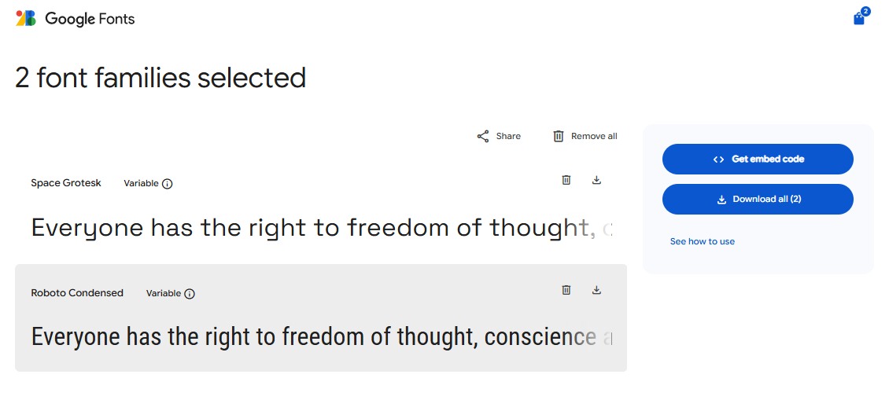

# README Essentials

## Title

Project Title — TalentTap

## Live Site

Link to the live site:

## User Stories
- (- (Must Have)) As an employer, I want to register and log in, so that I can manage my job ads securely.
- (Must Have)	As an employer, I want to create a new job ad, so that I can advertise an open position.
- (Must Have)	As an employer, I want to edit or delete my job ads, so that I can keep my listings accurate.
- (Must Have)	As a visitor, I want to view all available jobs, so that I can find roles that interest me.
- (Must Have)	As a visitor, I want to view full job details, so that I can read the full description before applying.
- (Must Have)	As a visitor, I want to apply for a job using a contact form, so that I can contact the employer directly.
- (Must Have)	As a user, I want the site to be mobile-responsive and accessible, so that everyone can use it easily.
- (Should Have)	As an employer, I want to view a list of my posted jobs on a dashboard, so that I can manage them easily.
- (Should Have)	As an employer, I want to mark a job as “Closed”, so that it’s no longer visible to applicants.
- (Should Have)	As a visitor, I want to search or filter jobs by keyword or location, so that I can find relevant roles quickly.
- (Should Have)	As a visitor, I want validation on the contact form, so that I can correct mistakes before submitting.
- (Should Have)	As an employer, I want to receive a notification or email when someone applies, so that I can respond quickly.
- (- (Could Have))	As a visitor, I want to get a confirmation email after applying, so that I know my message was received.
- (- (Could Have))	As an employer, I want to upload a company logo, so that job ads look professional.
- (- (Could Have))	As a visitor, I want to sort jobs by date or company, so that I can browse efficiently.
- (Could Have)	As an employer, I want to duplicate a job listing, so that I can post similar ads quickly.
- (Won't Have)	As a job seeker, I want to create an account and save jobs I like.
- (Won't Have)	As a job seeker, I want to upload my CV and track my applications.
- (Won't Have)	As an employer, I want analytics showing job views or applications.
- (Won't Have)	As a visitor, I want real-time chat with employers.

## Brief Introduction
TalentTap is a lightweight job board built to connect employers with candidates quickly and accessibly. Employers can create, edit and manage job listings from a simple dashboard, while visitors can browse, filter and view full job details, contact employers via a built-in form, and apply where a contact method is provided. The project focuses on clean, mobile-responsive pages, semantic HTML for accessibility, and a small, testable Django backend to handle job posting, form submissions and notification emails.

## Design

### Typography

We selected Space Grotesk and Roboto Condensed for their clean, modern feel—balancing personality with readability across the jobs board—while echoing the geometric precision and friendly tone of the logo for a cohesive brand experience.

#### Color Scheme

We chose vibrant blues and yellows for the jobs board to reflect the energy and optimism of career growth, while tying seamlessly into the logo’s palette to reinforce brand identity and visual cohesion.

## Website Features

Describe key features available in the website (authentication, search, forms, dashboards, etc.).

## Tablet / Mobile View

Notes about how the design adapts to smaller screens and any mobile-specific features.

## Future Features

Planned improvements or features to add later.

## Technologies Used

List languages, frameworks, libraries, programs, services and notable packages used.

Example:

- Python 3.x
- Django 4.x
- PostgreSQL
- Bootstrap / Tailwind CSS

## Deployment

Step-by-step process used for deploying the project (e.g., Heroku, Vercel, Render, Docker). Include commands and notes about environment variables, build steps and hosting caveats.

## Testing

Validation of HTML/CSS, Lighthouse audits, accessibility testing, unit/integration tests, and known bugs or limitations.

## Credits

Content references, media sources and acknowledgements.

### Attribution / Credit Requirements

You must include credit for:

- Images not owned by you
- Code that inspired you or that you adapted
- Text/copy that was not written by you
- Resources or tutorials that assisted your project

Proper attribution is important and helps other developers find referenced resources.

## Notes

- Don't forget to validate all JavaScript and Python code.
- Keep this README updated as the project evolves.

GK - test 