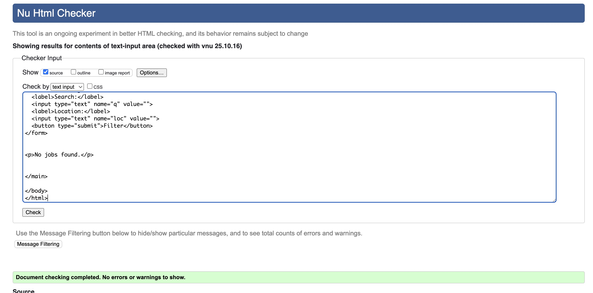

# README Essentials

## Title

Project Title — TalentTap

## Live Site

Link to the live site:

## User Stories
- (Must Have)) As an employer, I want to register and log in, so that I can manage my job ads securely.
- (Must Have)	As an employer, I want to create a new job ad, so that I can advertise an open position.
- (Must Have)	As an employer, I want to edit or delete my job ads, so that I can keep my listings accurate.
- (Must Have)	As a visitor, I want to view all available jobs, so that I can find roles that interest me.
- (Must Have)	As a visitor, I want to view full job details, so that I can read the full description before applying.
- (Must Have)	As a visitor, I want to apply for a job using a contact form, so that I can contact the employer directly.
- (Must Have)	As a user, I want the site to be mobile-responsive and accessible, so that everyone can use it easily.
- (Should Have)	As an employer, I want to view a list of my posted jobs on a dashboard, so that I can manage them easily.
- (Should Have)	As an employer, I want to mark a job as “Closed”, so that it’s no longer visible to applicants.
- (Should Have)	As a visitor, I want to search or filter jobs by keyword or location, so that I can find relevant roles quickly.
- (Should Have)	As a visitor, I want validation on the contact form, so that I can correct mistakes before submitting.
- (Should Have)	As an employer, I want to receive a notification or email when someone applies, so that I can respond quickly.
- (- (Could Have))	As a visitor, I want to get a confirmation email after applying, so that I know my message was received.
- (- (Could Have))	As an employer, I want to upload a company logo, so that job ads look professional.
- (- (Could Have))	As a visitor, I want to sort jobs by date or company, so that I can browse efficiently.
- (Could Have)	As an employer, I want to duplicate a job listing, so that I can post similar ads quickly.
- (Won't Have)	As a job seeker, I want to create an account and save jobs I like.
- (Won't Have)	As a job seeker, I want to upload my CV and track my applications.
- (Won't Have)	As an employer, I want analytics showing job views or applications.
- (Won't Have)	As a visitor, I want real-time chat with employers.

## Brief Introduction
TalentTap is a lightweight job board built to connect employers with candidates quickly and accessibly. Employers can create, edit and manage job listings from a simple dashboard, while visitors can browse, filter and view full job details, contact employers via a built-in form, and apply where a contact method is provided. The project focuses on clean, mobile-responsive pages, semantic HTML for accessibility, and a small, testable Django backend to handle job posting, form submissions and notification emails.

## ERD

---

## Design

### Typography

We selected Space Grotesk and Roboto Condensed for their clean, modern feel—balancing personality with readability across the jobs board—while echoing the geometric precision and friendly tone of the logo for a cohesive brand experience.

#### Color Scheme

### Wireframes

Below are the wireframes for the main pages and features of TalentTap. These illustrate the layout and user flow for desktop and mobile views:

**Job Listings (Desktop):**

**Job Listings (Mobile):**

**Login Page:**

**Register Page:**

**Post a Job:**

These images show the search/filter UI, job list, authentication forms, and job posting form for both desktop and mobile layouts.

--- 

## Design

## Colour Scheme

We chose vibrant blues and yellows for the jobs board to reflect the energy and optimism of career growth, while tying seamlessly into the logo’s palette to reinforce brand identity and visual cohesion.

---

## Website Features

### User Authentication
- Users can register and log in as employers using Django Allauth for secure authentication.
- Session management ensures users remain logged in across pages.

### Job Posting Management
- **Create**: Authenticated employers can create job postings through a form that includes fields for title, company, location, description, and contact email.
- **Edit**: Employers can edit their own job postings to update information as needed.
- **Delete**: Employers can remove job postings they have created.

### Job Listings
- All users (including non-authenticated visitors) can view the complete list of job postings.
- Each job listing displays key information and links to a detailed view.

### Job Details
- Users can click on any job listing to view full details including description, location, and contact information.

### Access Control
- Only authenticated employers can create, edit, or delete job postings.
- Employers can only edit or delete their own job postings for security and data integrity.

## Technologies Used

List languages, frameworks, libraries, programs, services and notable packages used.

Example:

- Python 3.x
- Django 4.x
- PostgreSQL
- Bootstrap / Tailwind CSS

---

## AI Augmentation & Reflection

**Tools Used:** ChatGPT, Copilot

**Usage:**

AI played a significant role as a **creative and technical collaborator** throughout the development of this project. Rather than acting as a code generator, AI was used as an **interactive coworker** — helping to brainstorm, refine ideas, and improve both the technical and written aspects of the work.

**Idea Development and Validation**

At the early stages, AI was used to explore and validate project ideas, helping to assess **feasibility**, **user needs**, and **potential feature sets**. Through iterative discussions, AI assisted in shaping the concept into a realistic and meaningful product aligned with the project’s goals — supporting mental health awareness and accessibility.

**Exploring User Stories and Design Choices**

During the planning phase, AI helped outline **user stories**, identify **core user journeys**, and refine interface ideas to ensure an intuitive user experience. It also supported early wireframing logic and database structure discussions, providing feedback on practical implementation paths.

**Coding and Problem Solving**

Throughout development, AI provided technical support by:

- Clarifying Django-specific functionality and best practices.  
- Suggesting improvements in **model structure**, **form validation**, and **view logic**.  
- Assisting in writing clean, readable, and well-documented code.  
- Debugging errors by explaining tracebacks and identifying likely causes.

This collaboration enabled faster iteration and deeper understanding of certain development aspects — turning coding sessions into an active learning process.

**Writing and Documentation**

AI also contributed to the **writing, editing, and refinement** of this documentation. It assisted in structuring sections clearly, polishing technical language, and maintaining a consistent tone throughout the report. However, all final decisions, implementations, and written content were carefully reviewed, edited, and approved by the developer to ensure accuracy and authenticity.

**Reflection**

Using AI as a coworker encouraged a more **reflective and collaborative approach** to development. It improved both productivity and confidence, allowing for continuous learning while maintaining ownership of every stage — from concept to deployment.

---

## Deployment
This website is deployed to Heroku from a GitHub repository, the following steps were taken:

#### Creating Repository on GitHub
- First make sure you are signed into [Github](https://github.com/) and go to the code institutes template, which can be found [here](https://github.com/Code-Institute-Org/gitpod-full-template).
- Then click on **use this template** and select **Create a new repository** from the drop-down. Enter the name for the repository and click **Create repository from template**.
- Once the repository was created, I clicked the green **gitpod** button to create a workspace in gitpod so that I could write the code for the site.

#### Creating an app on Heroku
- After creating the repository on GitHub, head over to [heroku](https://www.heroku.com/) and sign in.
- On the home page, click **New** and **Create new app** from the drop down.
- Give the app a name(this must be unique) and select a **region** I chose **Europe** as I am in Europe, Then click **Create app**.

#### Create a database 
- Log into [CIdatabase maker](https://www.heroku.com/](https://dbs.ci-dbs.net/))
- add your email address in input field and submit the form
- open database link in your email
- paste dabase URL in your DATABASE_URL variable in env.py file and in Heroku config vars

#### Deploying to Heroku.
- Head back over to [heroku](https://www.heroku.com/) and click on your **app** and then go to the **Settings tab**
- On the **settings page** scroll down to the **config vars** section and enter the **DATABASE_URL** which you will set equal to the elephantSQL URL, create **Secret key** this can be anything,
**CLOUDINARY_URL** this will be set to your cloudinary url and finally **Port** which will be set to 8000.
- Then scroll to the top and go to the **deploy tab** and go down to the **Deployment method** section and select **Github** and then sign into your account.
- Below that in the **search for a repository to connect to** search box enter the name of your repository that you created on **GitHub** and click **connect**
- Once it has been connected scroll down to the **Manual Deploy** and click **Deploy branch** when it has deployed you will see a **view app** button below and this will bring you to your newly deployed app.

---

## Testing

Testing has been completed for HTML, CSS, and Python code validation. Lighthouse performance reports have also been generated for both desktop and mobile views.

### Testing tools
- [HTML Validator](https://validator.w3.org/nu/) - Used to validate the HTML files.
- [CSS Validator](https://jigsaw.w3.org/css-validator/) - Used to validate the CSS code.
- [CI Python Linted](https://pep8ci.herokuapp.com/) - Used to validate Python code.
- Chrome Developer Tools - Lighthouse reports, template responsiveness

### HTML Validation

### CSS Validation

### Python Validation

### Lighthouse Report - Desktop

### Lighthouse Report - Mobile

## Manual Testing

The site was tested on two different browsers for compatibility: Safari & Chrome.

**Chrome & Safari Manual Testing**

| Test | Expected Result | Actual Result - Chrome | Actual Result - Safari |
|---|---|---|---|
| Load Home (`/`) | Loads and redirects to Jobs list (`/jobs/`) | success | success |
| Register new account (`/accounts/signup/`) | New user created; redirected as configured by allauth | success | success |
| Login with valid credentials (`/accounts/login/`) | User authenticated; navbar shows Logout & “Post a Job” | success | success |
| Login with invalid credentials | Form errors shown; no login | success | success |
| Logout (`/accounts/logout/`) | Session cleared; navbar shows Login/Register | success | success |
| Access admin as superuser (`/admin/`) | Admin dashboard accessible | success | success |
| Access admin as normal user | Not authorized; cannot access admin pages | success | success |
| View Jobs list (`/jobs/`) | List of jobs renders with title/company/location; owner actions visible only to owner | success | success |
| Post a new job (valid) (`/jobs/create/`) | Requires login; valid form creates job and redirects to detail | success | success |
| Post a new job (invalid) | Server-side validation errors displayed; job not created | success | success |
| View job detail (`/jobs/<id>/`) | Job fields render; owner sees Edit/Delete links | success | success |
| Edit existing job (owner) (`/jobs/<id>/edit/`) | Valid edits save; redirected to detail with success message | success | success |
| Attempt to edit another user’s job | Returns 403 “permission” response | success | success |
| Delete job — confirmation flow (`/jobs/<id>/delete/`) | GET shows confirm page; POST deletes and redirects to list | success | success |
| Apply to a job — valid submission | Application form accepts valid data; success message shown (email sent via console backend) | fail | fail |
| Apply to a job — invalid submission | Validation errors shown; no application saved | fail | fail |
| Search jobs — keyword (`q`) & location (`loc`) | List filters to matching results | success | success |
| Messages/flash notifications | Django messages appear after actions (create/edit/apply/delete) | success | success |
| Form labels & errors | Labels present; invalid fields show error text | success | success |
| Mobile viewport (responsive) | Layout adapts; nav stacks; content readable | success | success |
| Desktop viewport (responsive) | Layout displays correctly at common widths | success | success |

Validation of HTML/CSS, Lighthouse audits, accessibility testing, unit/integration tests, and known bugs or limitations.

## Debugging

From the testing carried out above, a bug was noted.

**Chrome & Safari Manual Testing**

| Test | Expected Result | Actual Result - Chrome | Actual Result - Safari |
|---|---|---|---|
| Apply to a job — valid submission | Application form accepts valid data; success message shown (email sent via console backend) | fail | fail |
| Apply to a job — invalid submission | Validation errors shown; no application saved | fail | fail |

---

## Credits

Special thanks to Code Institute for their excellent curriculum, guidance, and support throughout this project. Heartfelt appreciation to all team members for their collaboration, dedication, and hard work. Your creativity, feedback, and teamwork made TalentTap possible!

